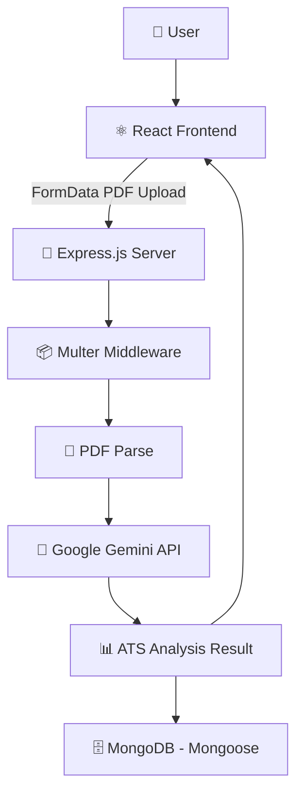
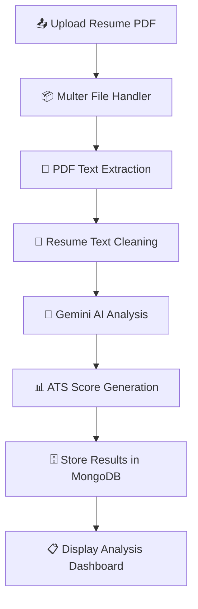

<div align="center">

# 🤖 AI Resume Analyzer

**An AI-powered ATS resume analyzer — upload your PDF and get instant feedback from Google Gemini**


</div>

---

## 📑 Table of Contents

- [Overview](#-overview)
- [Features](#-features)
- [Tech Stack](#-tech-stack)
- [Project Structure](#-project-structure)
- [Architecture](#-architecture)
- [Workflow](#-workflow)
- [API Endpoints](#-api-endpoints)
- [Analysis Output](#-analysis-output)
- [Getting Started](#-getting-started)
- [Learning Outcomes](#-learning-outcomes)
- [Future Improvements](#-future-improvements)
- [Author](#-author)

---

## 📖 Overview

**AI Resume Analyzer** is an AI-powered full-stack application that allows users to upload PDF resumes and receive a comprehensive **ATS (Applicant Tracking System)** analysis using **Google's Gemini AI**.

The application extracts text from uploaded resumes, sends it to Gemini for intelligent analysis, and returns an ATS score, identified strengths, detected weaknesses, and actionable improvement suggestions — all stored in MongoDB and displayed through a modern React dashboard.

---

## ✨ Features

| Feature | Description |
|---|---|
| 📄 Upload Resume (PDF) | Upload any PDF resume via the React frontend |
| 🔍 Extract Text from Resume | Automatically parse and extract raw text using PDF Parse |
| 🤖 AI-Powered Resume Analysis | Resume content analyzed by Google Gemini AI |
| 📊 ATS Score Generation | Receive a numeric ATS compatibility score |
| ✅ Strength Identification | Highlights what the resume does well |
| ⚠️ Weakness Detection | Identifies gaps and missing elements |
| 💡 Improvement Suggestions | Actionable tips to boost ATS performance |
| 🗄️ Store Analysis Results | All results persisted to MongoDB |
| ⚛️ Modern React Frontend | Clean, responsive analysis dashboard |
| 🔗 REST API Backend | Structured Express API for all operations |

---

## 🛠 Tech Stack

| Layer | Technologies |
|---|---|
| **Frontend** | React.js, Axios, CSS |
| **Backend** | Node.js, Express.js |
| **Database** | MongoDB, Mongoose |
| **AI & File Processing** | Google Gemini API, Multer, PDF Parse |

---

## 📁 Project Structure

```bash
ai-resume-analyzer/
│
├── frontend/
│   ├── src/
│   │   ├── components/       # Reusable UI components
│   │   ├── pages/            # Page-level components
│   │   ├── services/         # Axios API service calls
│   │   ├── App.jsx
│   │   └── main.jsx
│
├── backend/
│   ├── config/               # Database configuration
│   ├── controllers/          # Route handler logic
│   ├── middleware/           # Multer & error middleware
│   ├── models/               # Mongoose schemas
│   ├── routes/               # Express route definitions
│   ├── services/             # Gemini AI & PDF services
│   ├── uploads/              # Temporary PDF storage
│   └── server.js
│
└── README.md
```

---

## 🏗 Architecture



---

## 🔄 Workflow



---

## 📡 API Endpoints

| Method | Endpoint | Description |
|---|---|---|
| `POST` | `/api/resume/upload` | Upload a PDF resume and return AI analysis |
| `GET` | `/api/resume` | Retrieve all previously analyzed resumes |

### POST `/api/resume/upload`

Accepts a `multipart/form-data` request with a PDF file. Extracts text, sends to Gemini AI, stores result, and returns the full analysis.

```http
POST /api/resume/upload
Content-Type: multipart/form-data

Body: resume (PDF file)
```

### GET `/api/resume`

Returns all stored analysis results from MongoDB.

```http
GET /api/resume
```

---

## 📊 Analysis Output

A successful analysis returns a structured JSON object:

```json
{
  "atsScore": 88,
  "strengths": [
    "Strong technical skills",
    "Good project experience"
  ],
  "weaknesses": [
    "Lack of quantified achievements"
  ],
  "suggestions": [
    "Add measurable impact to projects"
  ]
}
```

| Field | Type | Description |
|---|---|---|
| `atsScore` | `Number` | ATS compatibility score out of 100 |
| `strengths` | `String[]` | Positive elements identified in the resume |
| `weaknesses` | `String[]` | Areas that reduce ATS compatibility |
| `suggestions` | `String[]` | Actionable steps for improvement |

---

## 🚀 Getting Started

### Prerequisites
- Node.js (v16+)
- MongoDB (local or Atlas)
- Google Gemini API Key

### 1. Clone the Repository

```bash
git clone https://github.com/Jeevan9898/ai-resume-analyzer.git
cd ai-resume-analyzer
```

### 2. Backend Setup

```bash
# Install backend dependencies
npm install

# Create environment file
cp .env.example .env
```

Add the following to your `.env`:

```env
MONGO_URI=your_mongodb_connection_string
GEMINI_API_KEY=your_gemini_api_key
PORT=5000
```

```bash
# Start the backend server
npm run dev
```

### 3. Frontend Setup

```bash
cd frontend
npm install
npm run dev
```

The frontend will run on `http://localhost:5173` and the backend on `http://localhost:5000`.

---

## 🎓 Learning Outcomes

- File Upload Handling using Multer
- PDF Text Extraction with PDF Parse
- AI Integration with Google Gemini API
- REST API Development
- MongoDB Data Storage
- React Component Architecture
- FormData and File Uploads
- Full Stack Application Development

---

## 🔮 Future Improvements

- [ ] Resume History Dashboard
- [ ] Authentication System
- [ ] User Profiles
- [ ] Resume Comparison
- [ ] Resume Download Reports
- [ ] Multiple Resume Formats
- [ ] Advanced ATS Scoring

---

## 👤 Author

**Jeevan Yadav**

[](https://jeevan-yadav.vercel.app/)
[](https://github.com/Jeevan9898)
